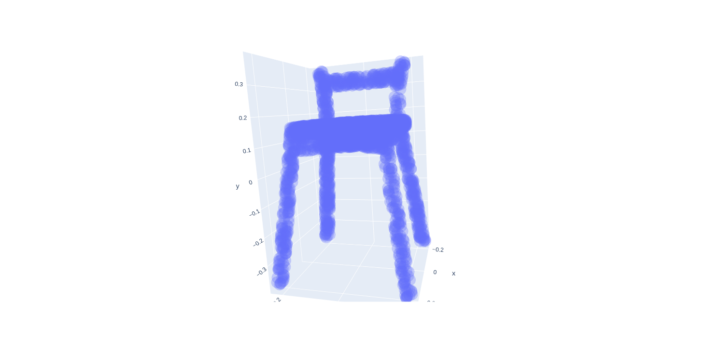

# Contrastive-Learning-On-PointClouds-PyTorch-Geometric
Contrastive Representation Learning for Point Clouds.

## General Framework

## Architecture Details

The encoder is comprised of Dynamic EdgeConv layers and the projection head is a Multi-Layer Perceptron.  
The loss function used in this project is the **NT-Xent Loss** as suggested in the SimCLR paper.  

## Results

This project uses the ShapeNet dataset and specifically the following classes - **Airplane, Chair, Lamp** and **Table** for training. 

#### Embedding Space visualized using T-SNE

### Point Cloud Visualization
**Query Idx: 4**  
 
  
**Match Idx: 8**  

## References
* [SimCLR](https://arxiv.org/pdf/2002.05709.pdf)
* [SimCLRv2](https://arxiv.org/pdf/2006.10029.pdf)
* [Dynamic Graph CNN for Learning on Point Clouds](https://arxiv.org/pdf/1801.07829.pdf)
* [Contrastive Representation Learning: A Framework and Review](https://arxiv.org/ftp/arxiv/papers/2010/2010.05113.pdf)
