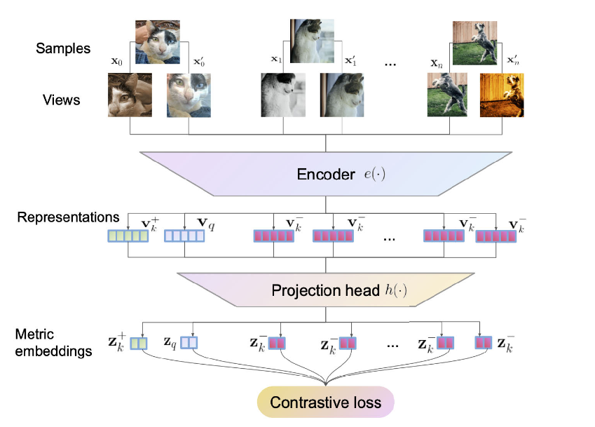

# Contrastive-Learning-On-PointClouds-PyTorch-Geometric
Contrastive Representation Learning for Point Clouds.

## General Framework

## Architecture Details

The encoder is comprised of Dynamic EdgeConv layers and the projection head is a Multi-Layer Perceptron.

## Results

This project uses the ShapeNet dataset and specifically the following classes - Airplane, Chair, Lamp and Table for training. 

#### Embedding Space visualized using T-SNE

## References

